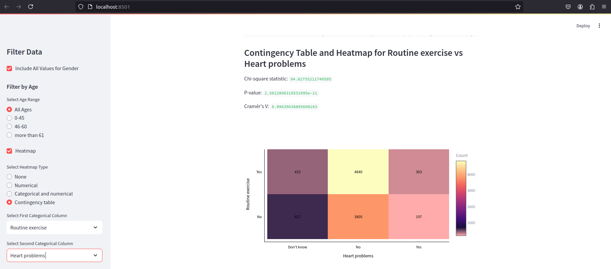

# Redcap Questionnaire Data Analysis Dashboard

This Streamlit dashboard provides an interactive interface to analyze and visualize data from a CSV file containing Redcap questionnaire dataset information. The dashboard allows users to filter data based on various parameters such as gender and age, and generate heatmaps and statistical plots for numerical and categorical data. It also supports the calculation of correlations and the creation of summary statistics for selected columns.

## Features

- **Sidebar Filters**: Users can filter the dataset by gender and age.
- **Heatmap Generation**: Create heatmaps for numerical columns, categorical and numerical correlations, or contingency tables.
- **Statistical Analysis**: Summary statistics (mean, median, standard deviation, IQR) for numerical columns.
- **Visualization**: Generate histograms, box plots, and correlation heatmaps.
- **Chi-square Test**: For contingency table analysis, including the calculation of Cramér's V.

## Requirements

To run this dashboard, you'll need the following Python libraries:

- pandas
- streamlit
- plotly
- numpy
- scipy

You can install the required libraries by running:

```bash
pip install pandas streamlit plotly numpy scipy
```

## Dashboard Preview

Below is a preview of the Redcap Data Analysis app's dashboard:



